 

### `01` About

I build digital products where **design clarity** meets **engineering rigor**. My approach starts with the real problem, not the technology — I help teams design and build fast, useful, memorable software.

<table>
<tr>
<td align="center"><b>4+</b> years building</td>
<td align="center"><b>20+</b> projects delivered</td>
<td align="center"><b>100%</b> product focused</td>
</tr>
</table>

 

### `02` Currently

- 🔭 Building full-stack web platforms — backend, frontend & infra
- 🌱 Exploring AI-assisted engineering workflows (Claude Code) and Omarchy/Hyprland tooling
- 🌐 Full portfolio & case studies → **[cheikh-portfolio-pi.vercel.app](https://cheikh-portfolio-pi.vercel.app)**

 

### `03` Toolkit

  

 

### `04` GitHub Stats

> Generated on a schedule by a GitHub Actions workflow in this repo — static SVGs, no third-party server dependency at request time.

  
  

  

 

### `05` Contribution Snake

  

 

